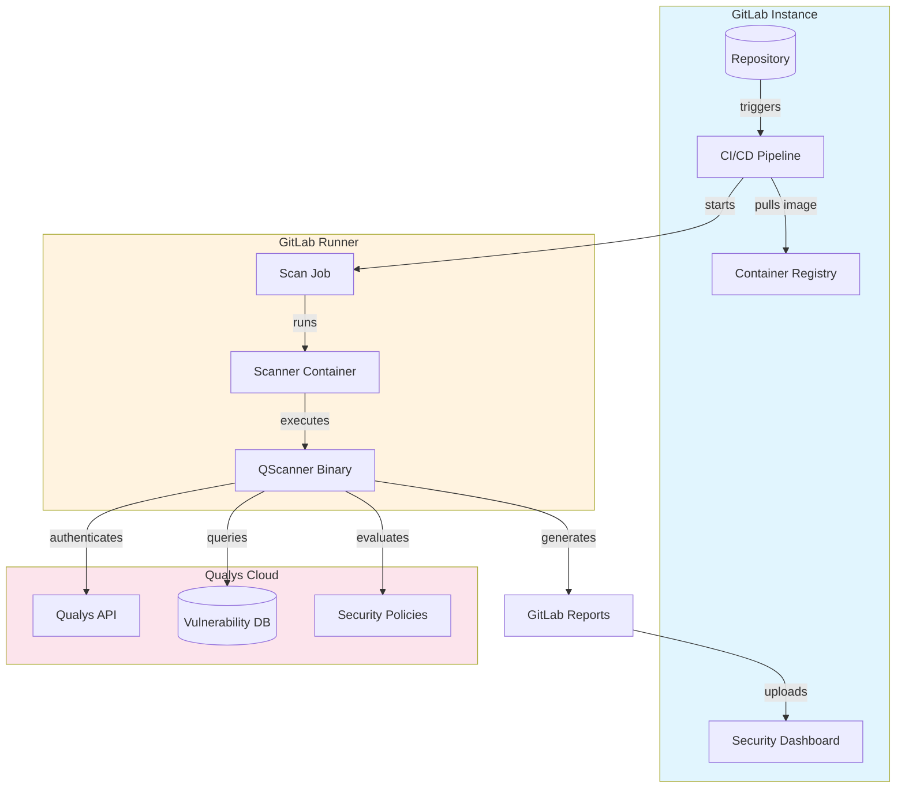
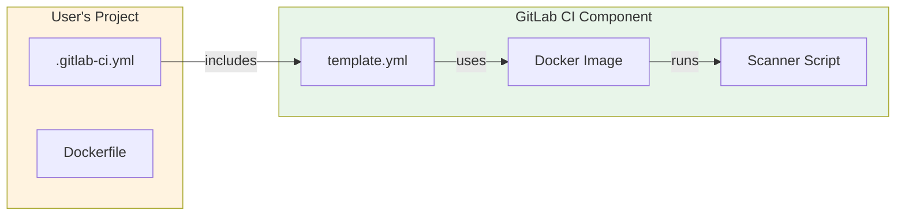
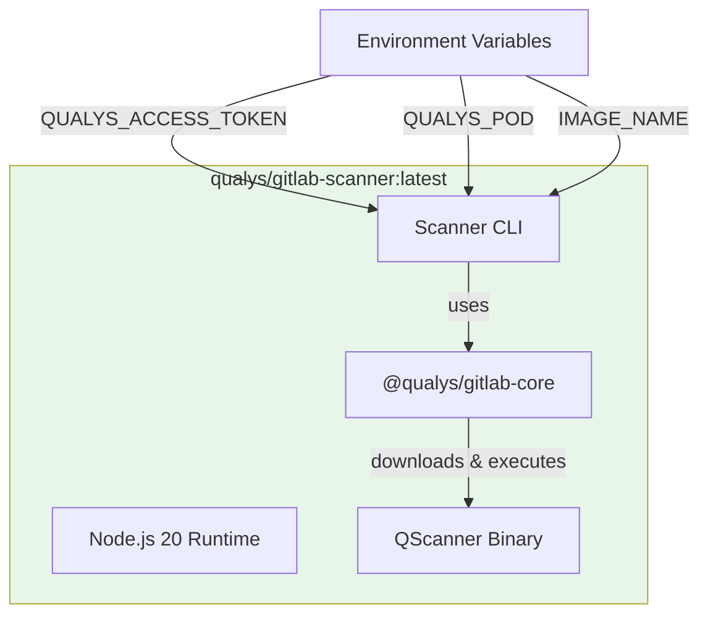
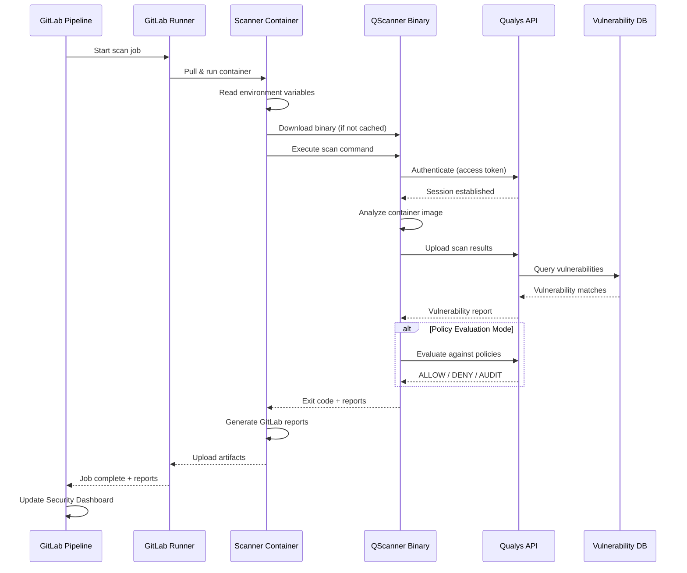
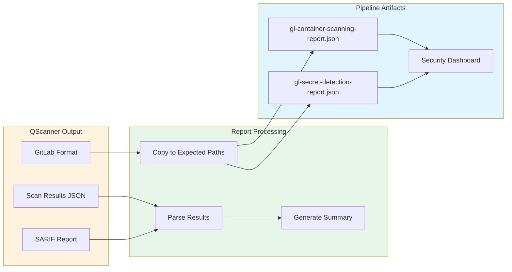
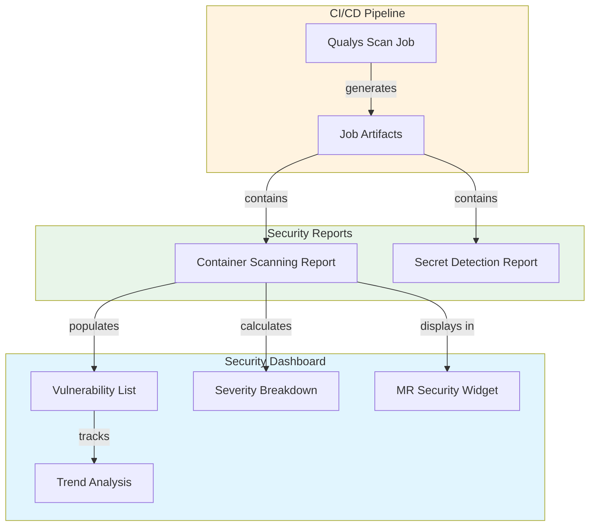

# Qualys GitLab Integration Architecture

## Overview

The Qualys GitLab integration enables automated container security scanning within GitLab CI/CD pipelines. When a pipeline runs, the Qualys scanner analyzes container images for vulnerabilities and reports findings directly to GitLab's Security Dashboard.

## Components

### GitLab CI Component

A reusable pipeline template that users include in their `.gitlab-ci.yml`:

### Scanner Container

The scanner runs as a Docker container within the GitLab Runner:

## Scan Execution Flow

## Report Generation

QScanner generates reports in GitLab's native format using `--report-format gitlab`:

## GitLab Security Dashboard Integration

## Exit Codes

| Code | Result | Pipeline Status |
|------|--------|-----------------|
| 0 | Success | Pass |
| 1 | Scan failed or vulnerabilities exceed threshold | Fail |
| 42 | Policy evaluation: DENY | Fail |
| 43 | Policy evaluation: AUDIT | Warning |

## Security

| Asset | Protection |
|-------|------------|
| Access Token | Masked in logs, stored encrypted in GitLab CI/CD variables |
| Scan Results | TLS in transit, stored in Qualys Cloud |
| Container Images | Never leave your infrastructure |
| Vulnerability Data | Fetched from Qualys, not stored locally |
