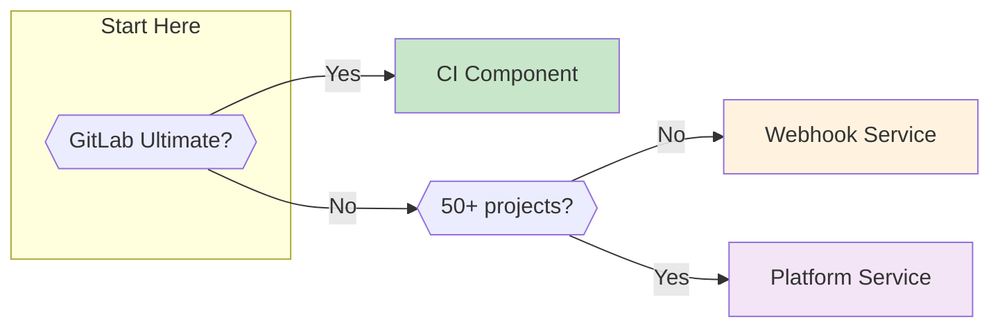
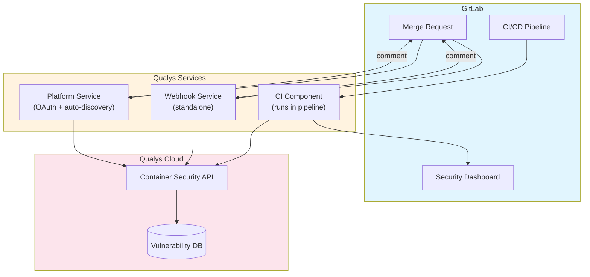
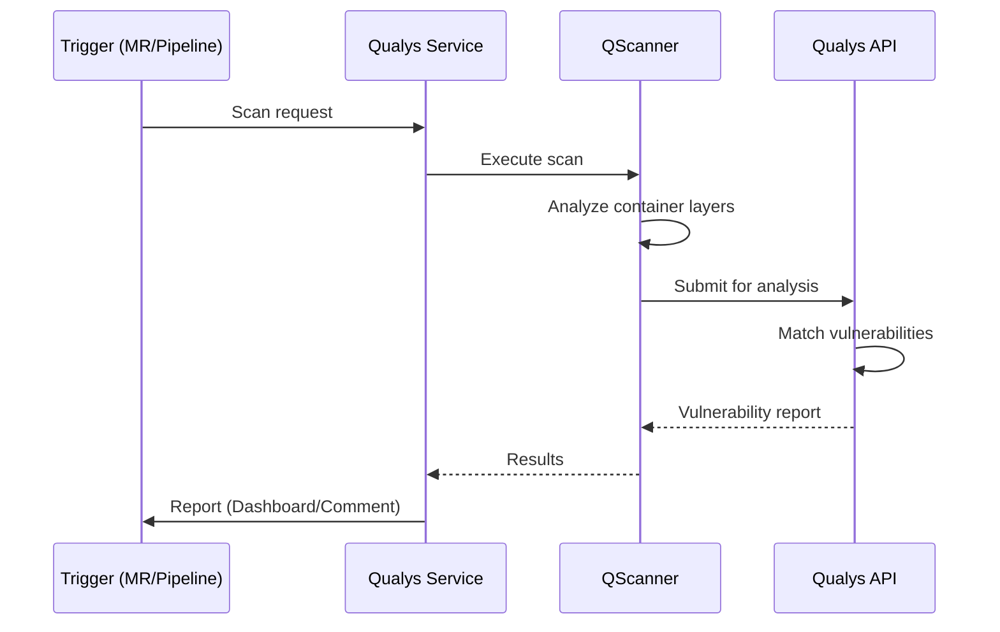

# Qualys GitLab Integration Architecture

## Quick Start

Choose your integration based on organizational needs:



## Integration Options

### Option 1: CI Component

For GitLab Ultimate users. Results appear in Security Dashboard.

```yaml
# .gitlab-ci.yml
include:
  - component: gitlab.com/qualys/qualys-container-scan@1.0.0
    inputs:
      image: "$CI_REGISTRY_IMAGE:$CI_COMMIT_SHA"
```

**Required CI/CD Variables:**
- `QUALYS_ACCESS_TOKEN` - Qualys API token (masked)
- `QUALYS_POD` - Platform POD (US1, US3, EU1, etc.)

### Option 2: Webhook Service

For self-managed GitLab. Posts results as MR comments.

```bash
docker run -d -p 3000:3000 \
  -e QUALYS_ACCESS_TOKEN="token" \
  -e QUALYS_POD="US3" \
  -e GITLAB_URL="https://gitlab.example.com" \
  -e GITLAB_TOKEN="gitlab-token" \
  qualys/gitlab-webhook-service:latest
```

**GitLab Setup:** Group > Settings > Webhooks > Add URL

### Option 3: Platform Service

Zero-configuration enterprise scanning. One OAuth click covers all repos.

```bash
docker run -d -p 3000:3000 \
  -e QUALYS_ACCESS_TOKEN="token" \
  -e QUALYS_POD="US3" \
  -e GITLAB_APP_ID="oauth-app-id" \
  -e GITLAB_APP_SECRET="oauth-secret" \
  -e BASE_URL="https://service.example.com" \
  qualys/gitlab-platform-service:latest
```

**Connect:** Visit `/oauth/connect` and authorize.

## System Overview



## Scan Flow

All integrations use the same QScanner engine:



## Comparison

| Feature | CI Component | Webhook Service | Platform Service |
|---------|--------------|-----------------|------------------|
| Setup per project | 5 min | 0 | 0 |
| Initial deployment | None | 30 min | 30 min |
| GitLab edition | Ultimate | Any | Any |
| Output format | Security Dashboard | MR Comment | MR Comment |
| New repo handling | Manual | Manual | Automatic |
| Token management | CI Variables | Service config | OAuth |

## Exit Codes

| Code | Meaning |
|------|---------|
| 0 | Scan passed |
| 1 | Scan failed or threshold exceeded |
| 42 | Policy: DENY |
| 43 | Policy: AUDIT |

## Supported PODs

US1, US2, US3, US4, EU1, EU2, CA1, IN1, AU1, UK1, AE1, KSA1

## Documentation

- [Technical Architecture Blog](blog-technical-architecture.md) - Detailed walkthrough with diagrams
- [Deployment Guide](deployment.md) - Build and publish instructions
- [Webhook Service](webhook-service.md) - Phase 2 configuration
- [Platform Service](platform-service.md) - Phase 3 zero-config setup
