# Qualys GitLab Integration Architecture

## Overview

The Qualys GitLab integration enables automated container security scanning within GitLab CI/CD pipelines. When a pipeline runs, the Qualys scanner analyzes container images for vulnerabilities and reports findings directly to GitLab's Security Dashboard.

## High-Level Architecture

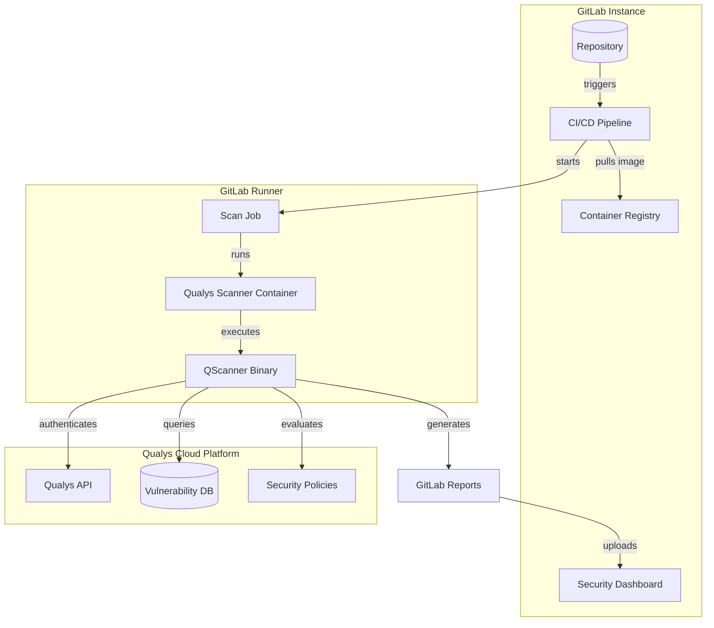

## Component Details

### 1. GitLab CI Component

The CI Component is a reusable pipeline template that users include in their `.gitlab-ci.yml`:

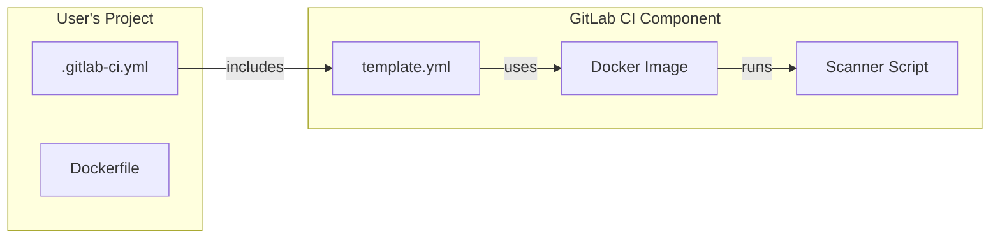

### 2. Scanner Docker Image

The scanner runs as a Docker container within the GitLab Runner:

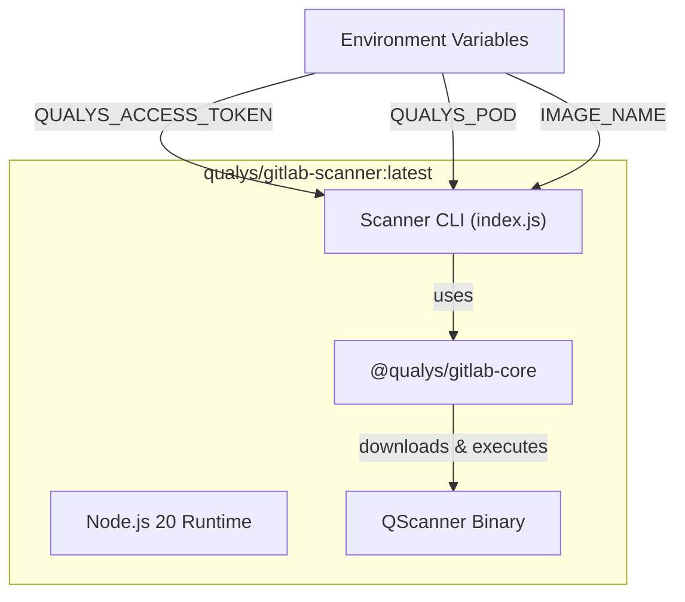

### 3. Scan Execution Flow

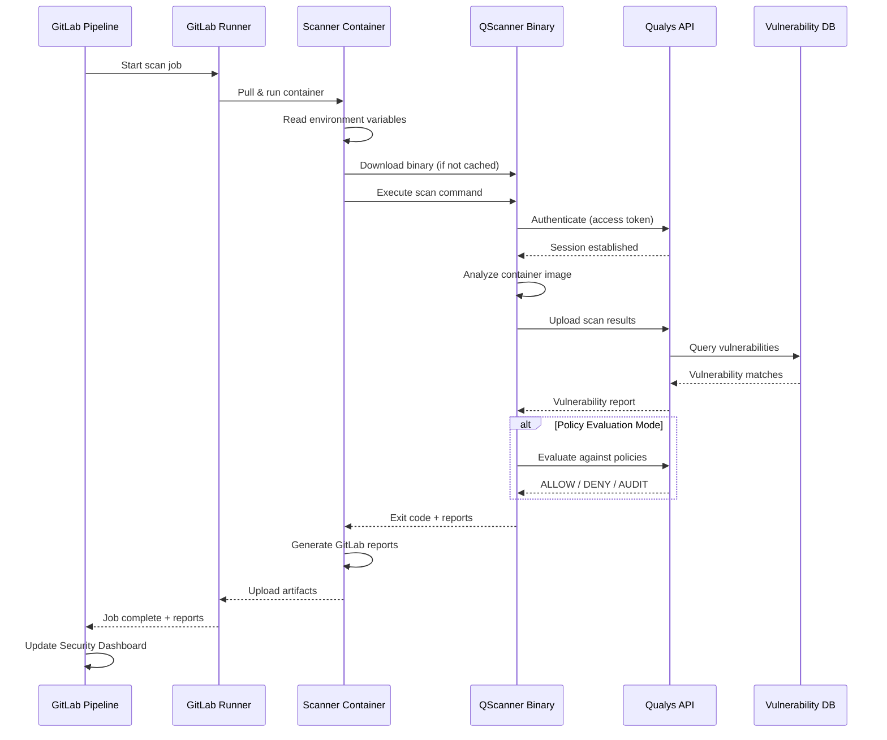

## Deployment Model

### Current Deployment: GitLab CI Component

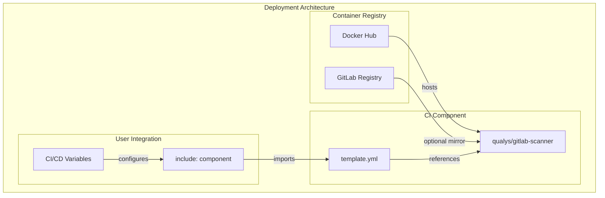

### Deployment Steps

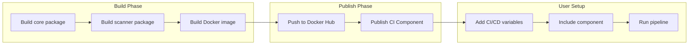

## Data Flow

### Authentication Flow

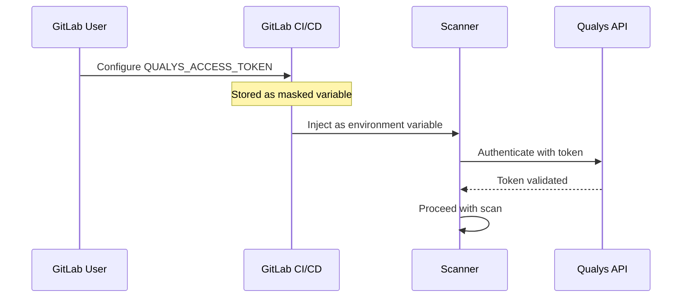

### Report Generation Flow

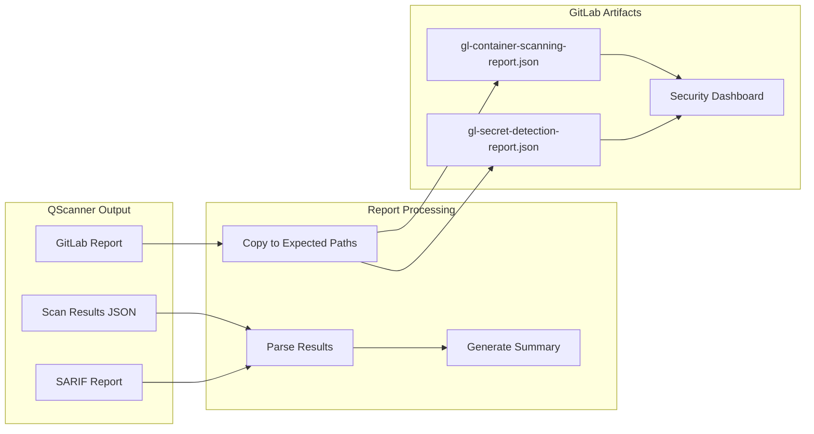

## GitLab Security Dashboard Integration

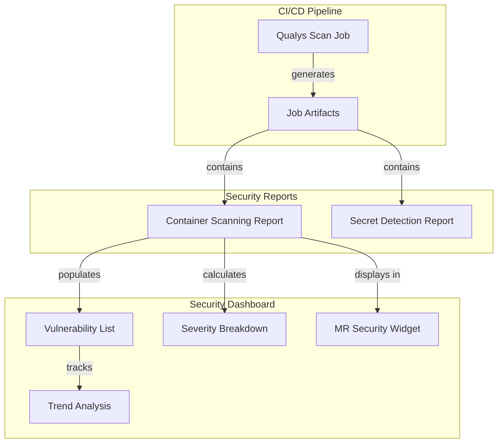

## Exit Codes and Pipeline Status

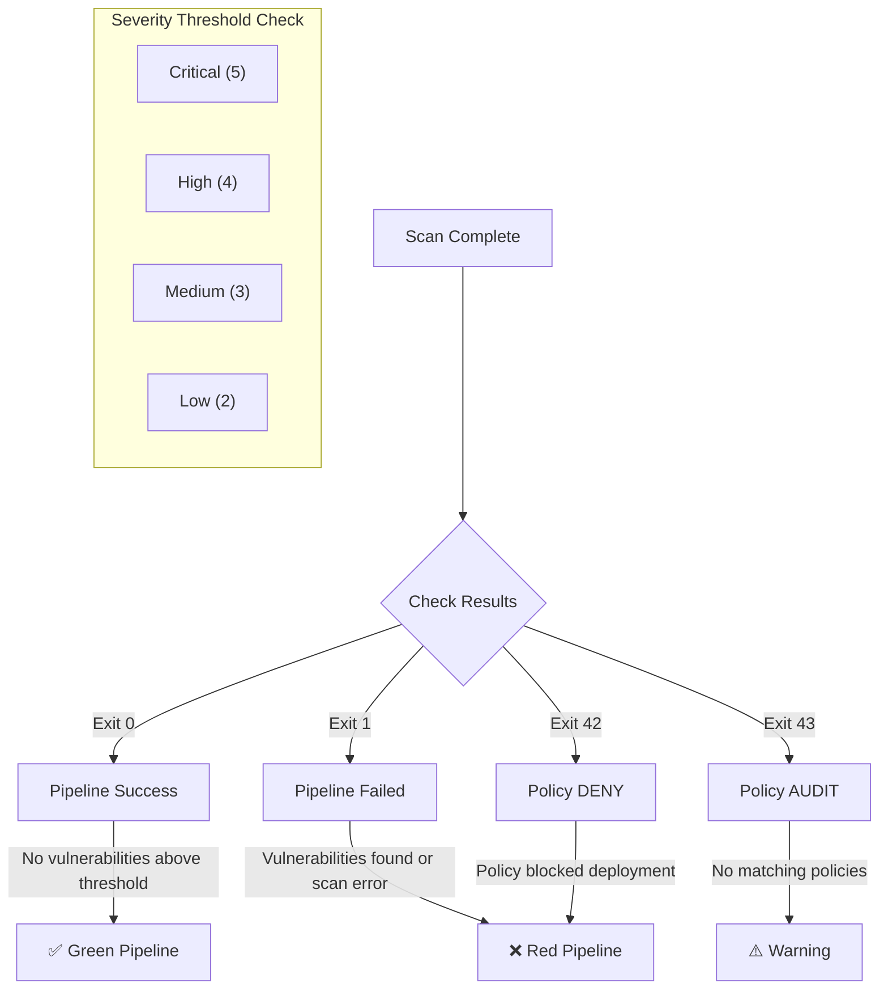

## Security Considerations

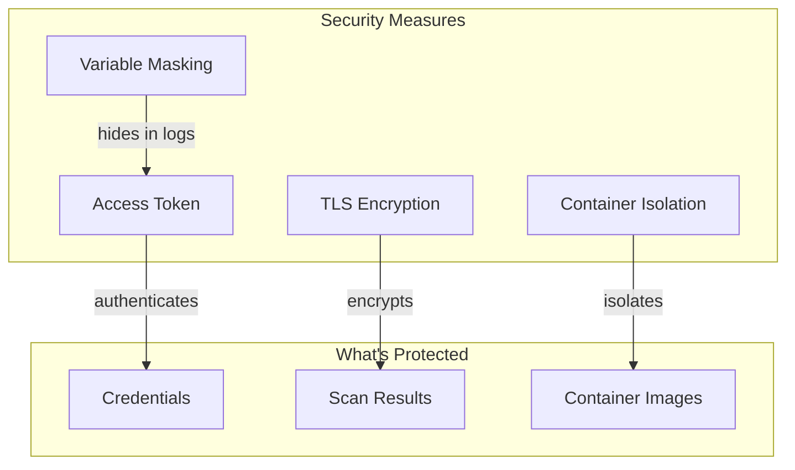
