# How Qualys GitLab Integration Works: A Deep Dive

Learn how the Qualys Container Security integration brings enterprise-grade vulnerability scanning directly into your GitLab CI/CD pipelines, with results appearing in GitLab's native Security Dashboard.

---

## The Problem: Security as an Afterthought

Traditional security scanning happens too late in the development cycle. Teams build and deploy applications, then run security scans as a separate process. By the time vulnerabilities are discovered, the code is already in production.

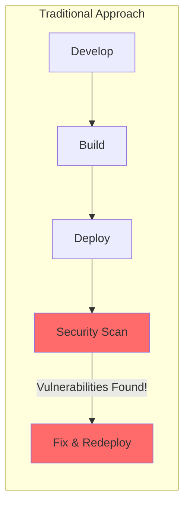

## The Solution: Shift-Left Security

The Qualys GitLab integration shifts security scanning left—into the CI/CD pipeline itself. Every merge request triggers an automatic scan, catching vulnerabilities before they reach production.

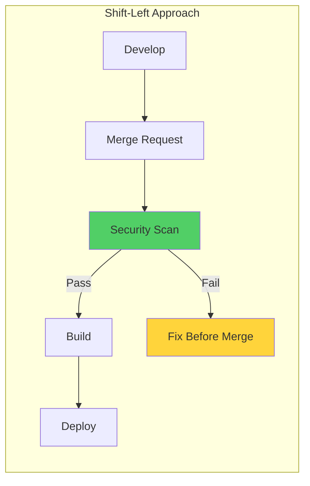

---

## Architecture Overview

The integration consists of three main components working together:

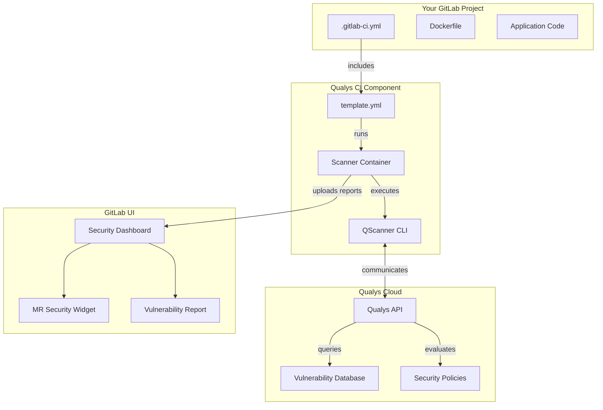

---

## How a Scan Works: Step by Step

Let's walk through exactly what happens when a developer pushes code:

### Step 1: Pipeline Triggered

When a developer pushes to a branch or opens a merge request, GitLab's CI/CD pipeline starts.

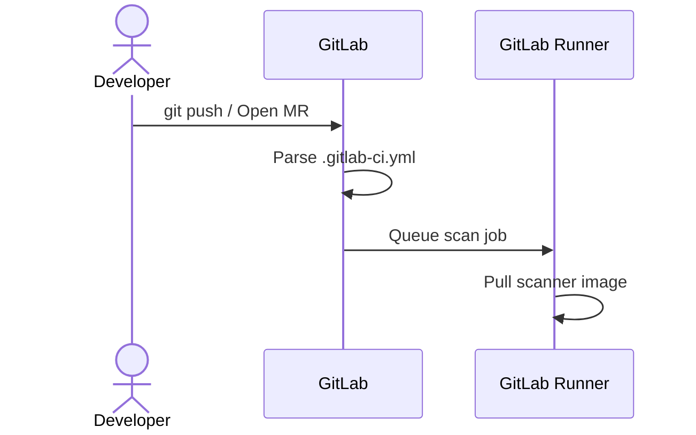

### Step 2: Scanner Initialization

The scanner container starts and reads configuration from environment variables:

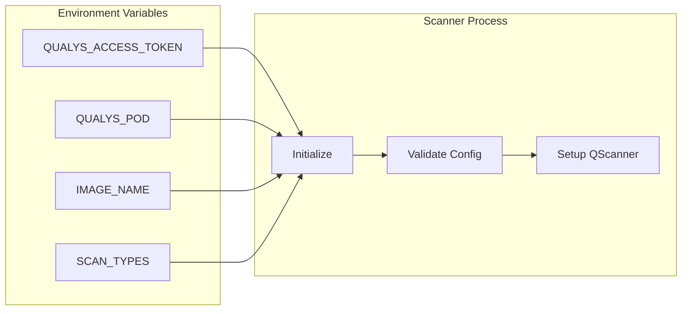

### Step 3: QScanner Binary Setup

The scanner downloads and verifies the QScanner binary:

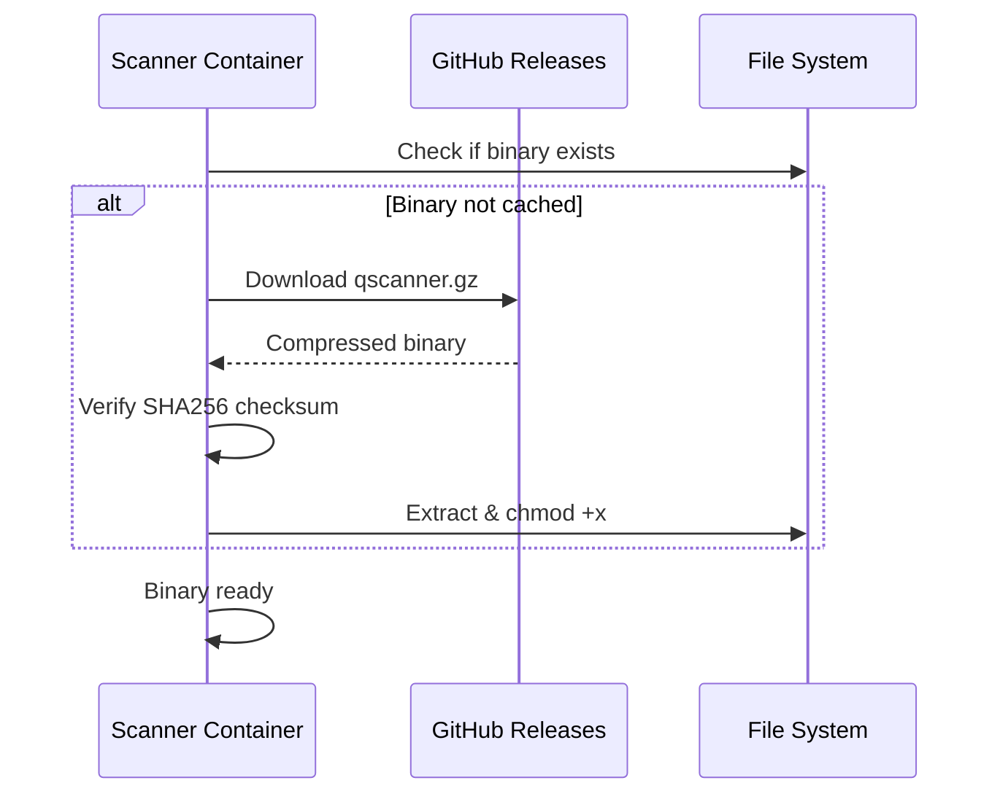

### Step 4: Container Image Analysis

QScanner analyzes the target container image layer by layer:

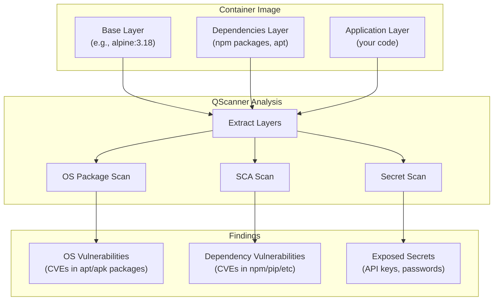

### Step 5: Qualys Cloud Processing

The scan results are sent to Qualys Cloud for enrichment:

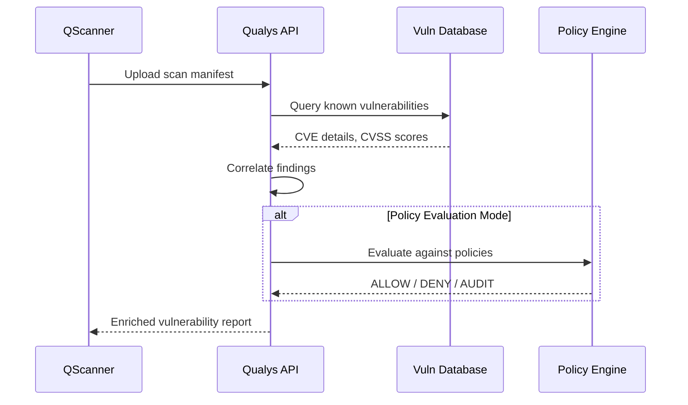

### Step 6: Report Generation

QScanner generates reports in GitLab's native format:

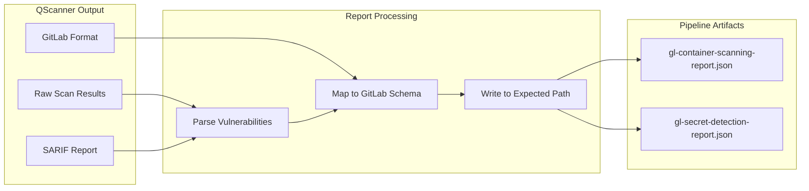

### Step 7: GitLab Security Dashboard

GitLab ingests the reports and displays them in the Security Dashboard:

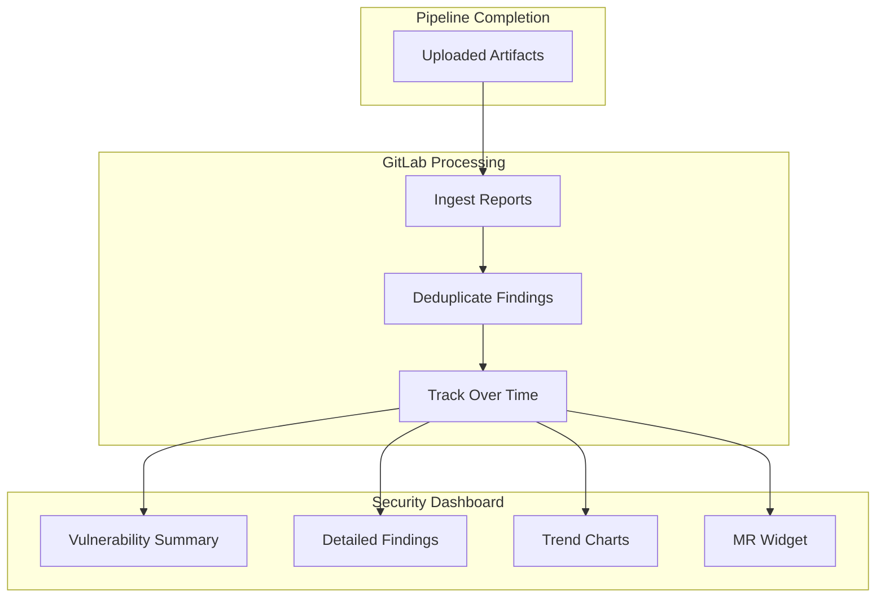

---

## The GitLab Report Format

QScanner's `--report-format gitlab` generates reports that match GitLab's expected schema:

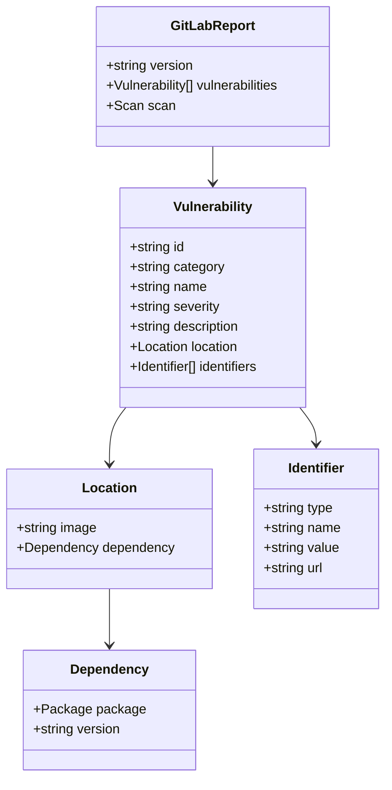

---

## Policy Evaluation: Gate Your Deployments

With policy evaluation mode, Qualys can enforce security gates:

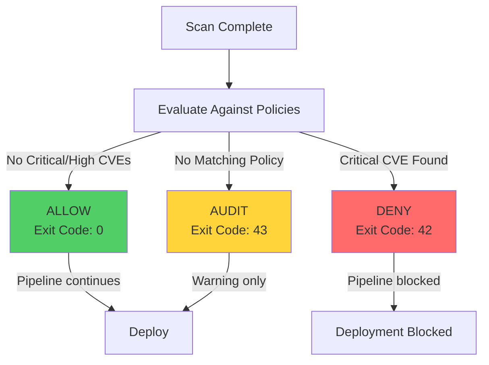

---

## Performance Considerations

### Caching Strategy

The scanner caches the QScanner binary to speed up subsequent runs:

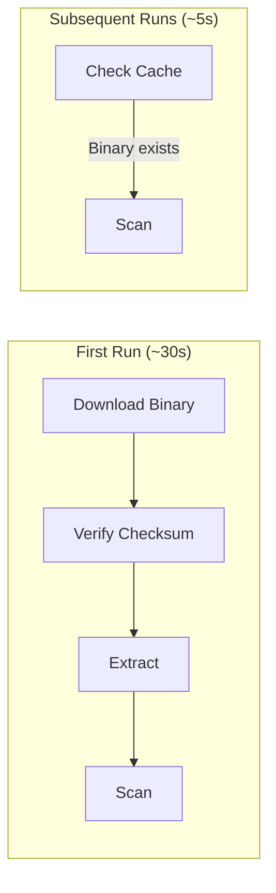

### Parallel Scanning

For monorepos with multiple images, run scans in parallel:

```yaml
scan-frontend:
  extends: .qualys-scan
  variables:
    IMAGE_NAME: "$CI_REGISTRY_IMAGE/frontend:$CI_COMMIT_SHA"

scan-backend:
  extends: .qualys-scan
  variables:
    IMAGE_NAME: "$CI_REGISTRY_IMAGE/backend:$CI_COMMIT_SHA"

scan-worker:
  extends: .qualys-scan
  variables:
    IMAGE_NAME: "$CI_REGISTRY_IMAGE/worker:$CI_COMMIT_SHA"
```

```mermaid
gantt
    title Parallel Scan Execution
    dateFormat X
    axisFormat %s

    section Frontend
    Scan frontend    :0, 30

    section Backend
    Scan backend     :0, 45

    section Worker
    Scan worker      :0, 25

    section Pipeline
    All scans complete :milestone, 45, 0
```

---

## Security Model

### How Credentials Flow

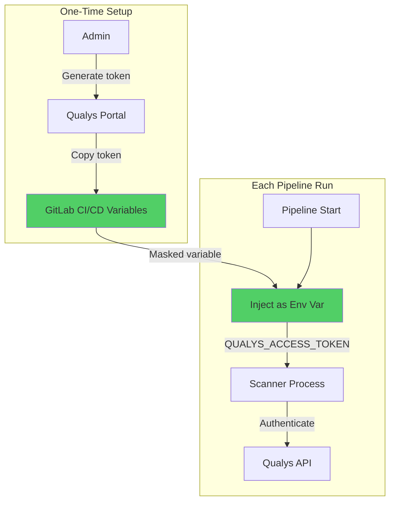

### What's Protected

| Asset | Protection |
|-------|------------|
| Access Token | Masked in logs, stored encrypted |
| Scan Results | TLS in transit, stored in Qualys Cloud |
| Container Images | Never leave your infrastructure |
| Vulnerability Data | Fetched from Qualys, not stored locally |

---

## Summary

The Qualys GitLab integration provides:

1. **Automated Scanning** - Every MR triggers a security scan
2. **Native Integration** - Results appear in GitLab's Security Dashboard
3. **Policy Enforcement** - Block deployments based on security policies
4. **Zero Configuration** - Add one line to your `.gitlab-ci.yml`

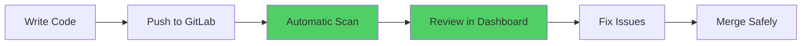

---

## Getting Started

Add this to your `.gitlab-ci.yml`:

```yaml
include:
  - component: gitlab.com/qualys/qualys-container-scan@1.0.0

qualys-container-scan:
  variables:
    QUALYS_POD: "US3"
    IMAGE_NAME: "$CI_REGISTRY_IMAGE:$CI_COMMIT_SHA"
```

Set `QUALYS_ACCESS_TOKEN` in your CI/CD variables, and you're done!
