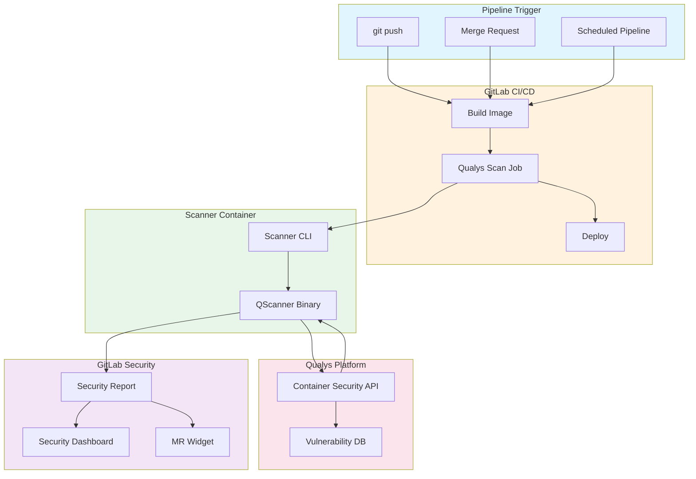
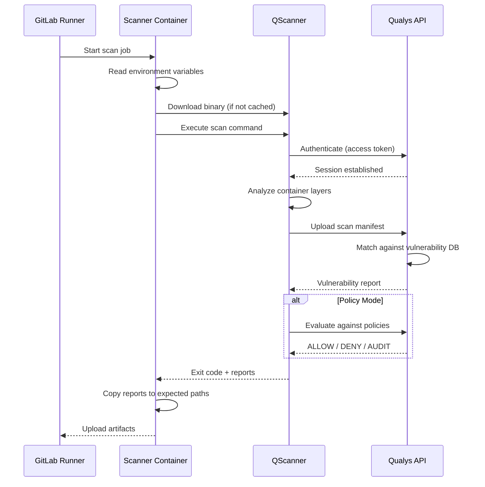
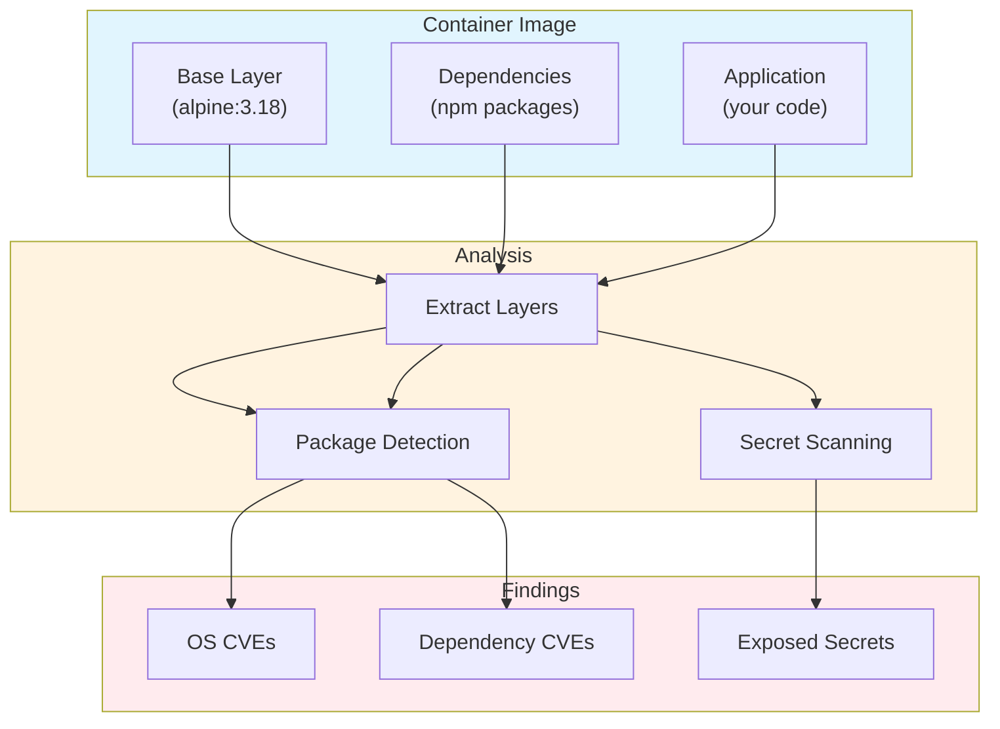
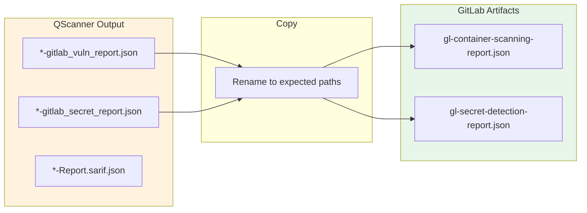
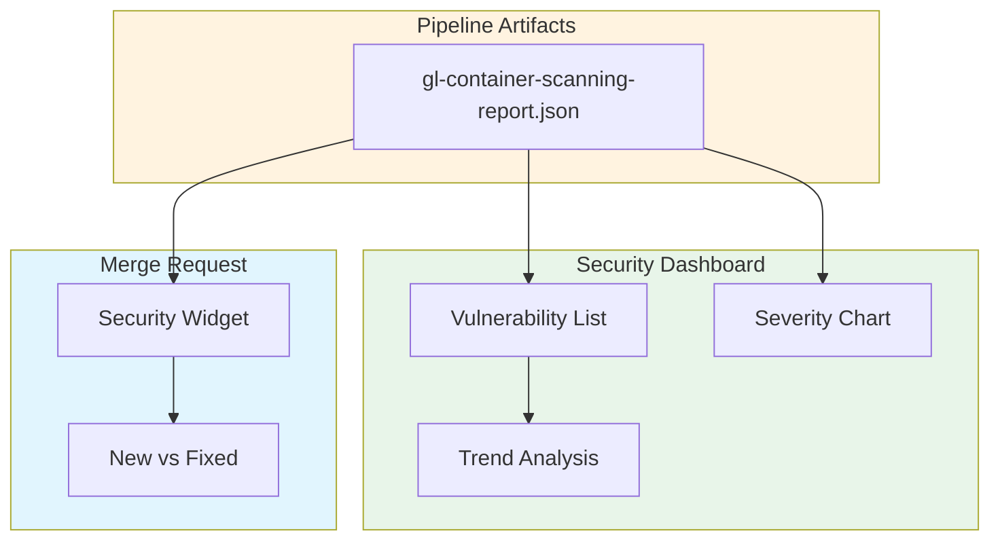
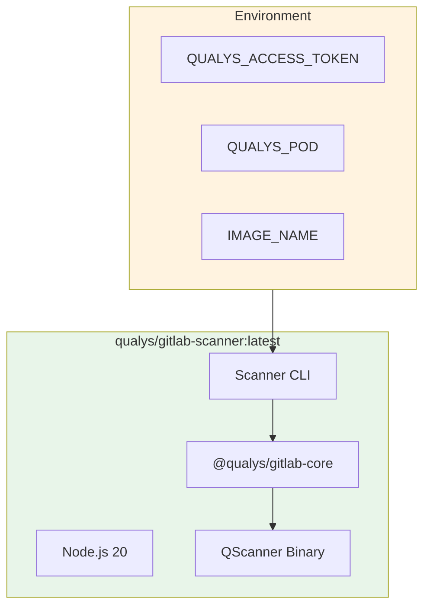

# Container Security Scanning for GitLab CI/CD with Qualys

Every container image deployed through GitLab represents a potential attack surface. Base images ship with unpatched OS packages. Application dependencies carry known CVEs. The window between deployment and vulnerability discovery represents active risk exposure.

This post presents an integration that triggers Qualys vulnerability scans automatically within GitLab CI/CD pipelines. Results appear directly in GitLab's Security Dashboard. Developers see findings in merge request widgets before code reaches production.

## The Container Security Challenge

Traditional container scanning approaches create coverage gaps:

- **Scheduled scans**: Images deployed between scan windows run unanalyzed in production
- **Manual triggers**: Developers forget, skip, or disable scanning to meet deadlines
- **Build-time only**: Base image vulnerabilities discovered post-deployment require re-scanning
- **External dashboards**: Security findings disconnected from developer workflow

The solution is pipeline-integrated scanning with native GitLab reporting. Every container build triggers analysis automatically. Results flow into GitLab's Security Dashboard. No gaps in coverage.

## Architecture Overview



When a developer pushes code or opens a merge request, GitLab's CI/CD pipeline builds the container image and triggers a scan job. The scanner container executes QScanner against the built image. QScanner authenticates with the Qualys API, uploads scan results, and retrieves vulnerability findings. The scanner generates GitLab-format reports that populate the Security Dashboard and merge request widget.

## Key Capabilities

### Native GitLab Report Format

QScanner v4.8+ includes `--report-format gitlab` which generates reports matching GitLab's security scanner schema:

```bash
qscanner --pod US3 --mode get-report \
  --report-format gitlab,sarif \
  image $CI_REGISTRY_IMAGE:$CI_COMMIT_SHA
```

Output files:
- `*-gitlab_vuln_report.json` - Container scanning report
- `*-gitlab_secret_report.json` - Secret detection report

These reports integrate directly with GitLab Ultimate's Security Dashboard without transformation.

### Software Composition Analysis

QScanner performs SCA across all container layers:

| Layer Type | Detected Artifacts |
|------------|-------------------|
| OS Packages | apt, apk, rpm, dpkg |
| Python | wheel, egg, conda, pip |
| Node.js | package.json, yarn.lock |
| Java | JAR, WAR, EAR, Gradle, Maven |
| Go | Go binaries, go.mod |
| .NET | packages.lock.json, deps.json |
| Rust | Cargo.lock, cargo-auditable |

### Secret Detection

QScanner identifies exposed secrets in container filesystems:

- API keys and tokens
- Database connection strings
- Private keys and certificates
- Cloud provider credentials

Results include file path and line number without exposing actual secret content.

### Policy Evaluation

Security teams define policies centrally through the Qualys Portal. QScanner evaluates scans against these policies and returns pass/fail exit codes:

```bash
qscanner --pod US3 --mode evaluate-policy \
  --policy-tags production \
  image $CI_REGISTRY_IMAGE:$CI_COMMIT_SHA

# Exit code 0: policy passed, deployment proceeds
# Exit code 42: policy failed, block the pipeline
```

## Scan Execution Flow



### Image Analysis

QScanner extracts and analyzes container layers without running the image:



### Report Processing

The scanner copies QScanner output to GitLab's expected paths:



## GitLab Integration

### Pipeline Configuration

Add the component to your `.gitlab-ci.yml`:

```yaml
include:
  - component: gitlab.com/qualys/qualys-container-scan@1.0.0
    inputs:
      pod: "US3"
      image: "$CI_REGISTRY_IMAGE:$CI_COMMIT_SHA"
      scan_types: "pkg,secret"
```

### CI/CD Variables

Configure authentication in GitLab CI/CD settings:

| Variable | Description |
|----------|-------------|
| `QUALYS_ACCESS_TOKEN` | Qualys API access token (masked) |
| `QUALYS_POD` | Platform POD (US1, US2, US3, EU1, etc.) |

### Security Dashboard



GitLab processes the uploaded reports and:

- Populates the Security Dashboard with vulnerability details
- Shows severity breakdown and trend charts
- Displays findings in merge request widgets
- Tracks new vs fixed vulnerabilities between commits

## Exit Codes and Pipeline Control

| Exit Code | Meaning | Pipeline Result |
|-----------|---------|-----------------|
| 0 | Scan successful, no policy violations | Pass |
| 1 | Scan error or vulnerabilities exceed threshold | Fail |
| 42 | Policy evaluation returned DENY | Fail |
| 43 | Policy evaluation returned AUDIT (no matching policy) | Warning |

### Severity Thresholds

Control pipeline behavior with `FAIL_ON_SEVERITY`:

| Value | Behavior |
|-------|----------|
| 5 | Fail on critical vulnerabilities |
| 4 | Fail on high or critical |
| 3 | Fail on medium, high, or critical |
| 0 | Never fail based on severity |

## Deployment

### Docker Image

The scanner runs as a container within the GitLab Runner:



### Build and Publish

```bash
# Build
npm install
npm run build
docker build -t qualys/gitlab-scanner:latest \
  -f packages/gitlab-ci-component/Dockerfile .

# Publish
docker push qualys/gitlab-scanner:latest
```

## Supported PODs

| POD | Region |
|-----|--------|
| US1, US2, US3, US4 | United States |
| EU1, EU2 | Europe |
| CA1 | Canada |
| IN1 | India |
| AU1 | Australia |
| UK1 | United Kingdom |
| AE1 | UAE |
| KSA1 | Saudi Arabia |

## Troubleshooting

| Issue | Resolution |
|-------|------------|
| Authentication failed | Verify QUALYS_ACCESS_TOKEN is set correctly |
| Platform not supported | Ensure linux-amd64 runner with Docker executor |
| Scan timeout | Increase SCAN_TIMEOUT variable |
| No report generated | Check scan logs for errors |
| Image not found | Verify IMAGE_NAME points to accessible registry |

## Conclusion

Container security requires continuous visibility integrated into the development workflow. Scheduled scans and external dashboards create gaps that attackers exploit. Pipeline-integrated scanning closes this gap by analyzing every container build automatically.

The architecture presented here delivers:

- **Zero-gap coverage**: Every pipeline run triggers a scan
- **Native integration**: Results appear in GitLab Security Dashboard
- **Policy enforcement**: Block deployments based on security policies
- **Developer workflow**: Findings visible in merge request widgets

Every git push becomes an opportunity to validate security posture before workloads serve production traffic. Detection happens in minutes. And the same QScanner binary that powers this integration works across AWS Lambda, Azure ACI, and traditional container registries.
