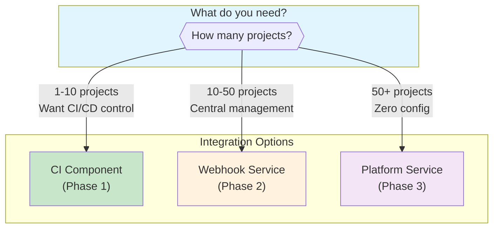
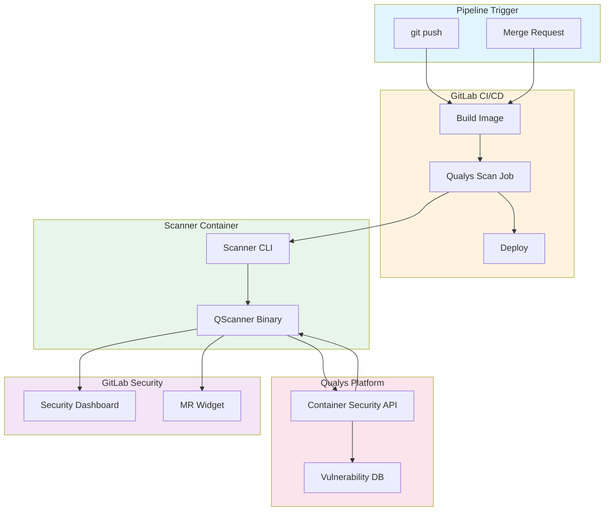
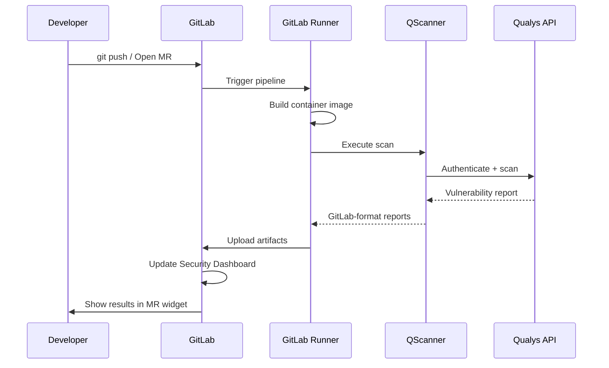
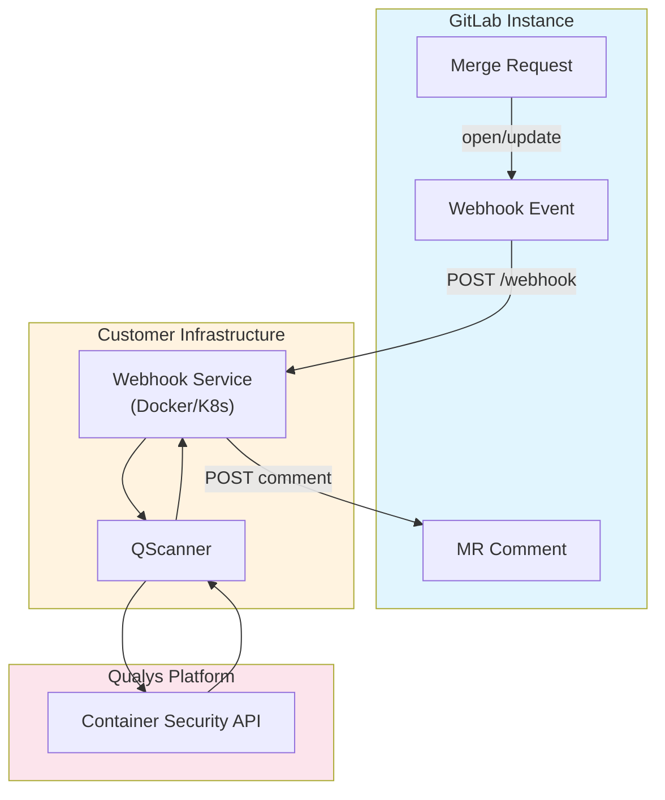
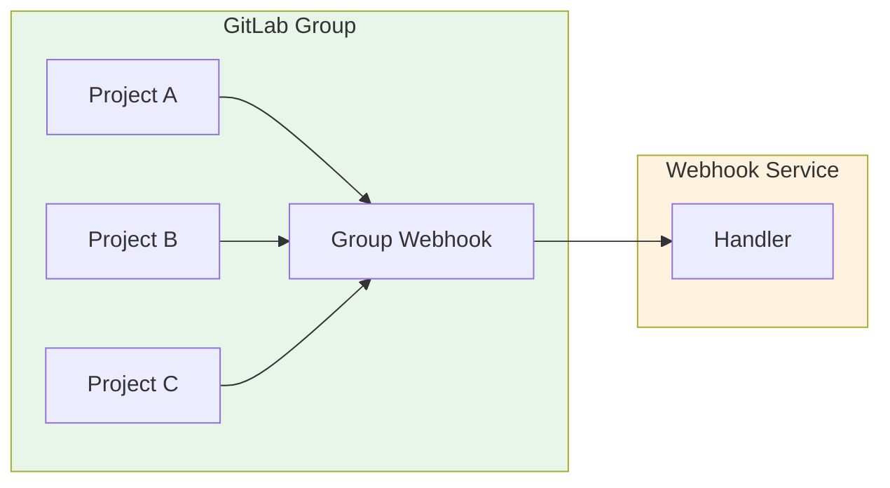
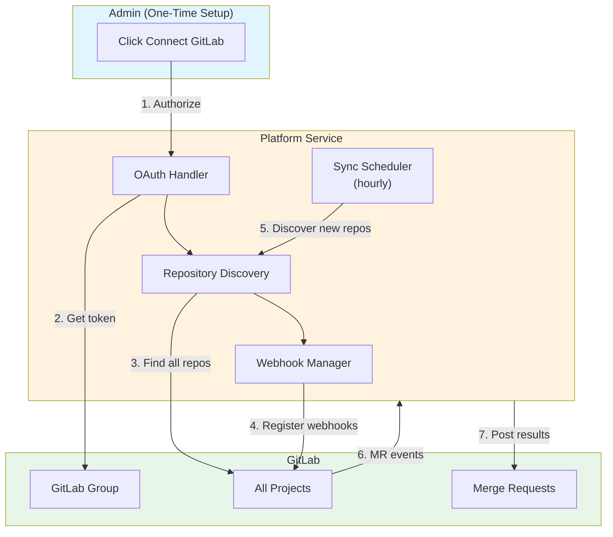
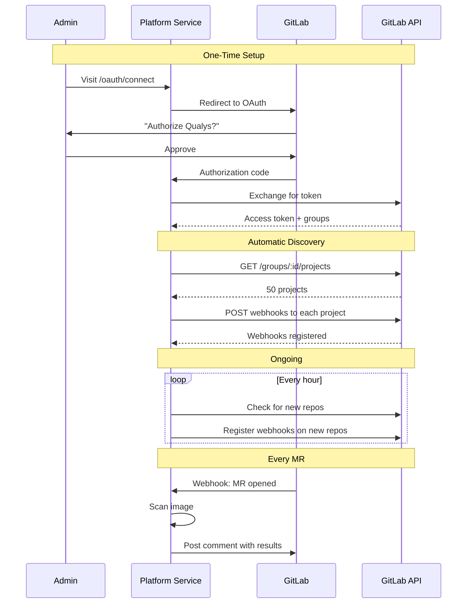
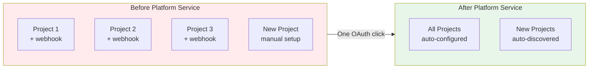

# Container Security Scanning for GitLab with Qualys

Every container image deployed through GitLab represents a potential attack surface. Base images ship with unpatched OS packages. Application dependencies carry known CVEs. The window between deployment and vulnerability discovery represents active risk exposure.

This post presents three integration options for Qualys container scanning with GitLab. Each option addresses different organizational needs, from single-project CI/CD integration to zero-configuration enterprise-wide scanning.

## Choose Your Integration



| Feature | CI Component | Webhook Service | Platform Service |
|---------|--------------|-----------------|------------------|
| Setup per project | Yes | One webhook per group | None |
| New repo coverage | Manual | Manual | Automatic |
| Results location | Security Dashboard | MR Comments | MR Comments |
| Customer deployment | None | Container | Container |
| Best for | CI/CD integration | Central scanning | Enterprise-wide |

## Option 1: CI Component (Recommended for GitLab Ultimate)

The CI Component integrates directly into GitLab CI/CD pipelines. Scan results appear in GitLab's Security Dashboard and merge request widgets.

### Architecture



### Customer Setup (5 minutes per project)

**Step 1: Configure CI/CD Variables**

Navigate to Settings > CI/CD > Variables and add:

| Variable | Type | Value |
|----------|------|-------|
| `QUALYS_ACCESS_TOKEN` | Masked | Your Qualys API token |
| `QUALYS_POD` | Variable | Your Qualys POD (US1, US3, EU1, etc.) |

**Step 2: Add Component to Pipeline**

Edit `.gitlab-ci.yml`:

```yaml
include:
  - component: gitlab.com/qualys/qualys-container-scan@1.0.0
    inputs:
      image: "$CI_REGISTRY_IMAGE:$CI_COMMIT_SHA"
```

**Step 3: Run Pipeline**

Push code or open a merge request. The scan runs automatically.

### Scan Flow



### Configuration Options

```yaml
include:
  - component: gitlab.com/qualys/qualys-container-scan@1.0.0
    inputs:
      pod: "US3"                              # Qualys POD
      image: "$CI_REGISTRY_IMAGE:$CI_COMMIT_SHA"
      scan_types: "pkg,secret"                # pkg, secret, malware
      mode: "get-report"                      # get-report, evaluate-policy
      policy_tags: "production,pci"           # For evaluate-policy mode
      fail_on_severity: "4"                   # 5=critical, 4=high, 3=medium
      stage: "test"                           # Pipeline stage
      allow_failure: "false"                  # Block pipeline on failure
```

---

## Option 2: Webhook Service (Recommended for Self-Managed GitLab)

The Webhook Service runs as a standalone container. GitLab sends webhook events when merge requests are opened or updated. The service scans the container image and posts results as MR comments.

### Architecture



### Customer Setup (30 minutes)

**Step 1: Deploy the Webhook Service**

```bash
docker run -d \
  -p 3000:3000 \
  -e QUALYS_ACCESS_TOKEN="your-token" \
  -e QUALYS_POD="US3" \
  -e GITLAB_URL="https://gitlab.example.com" \
  -e GITLAB_TOKEN="your-gitlab-token" \
  -v /var/run/docker.sock:/var/run/docker.sock:ro \
  qualys/gitlab-webhook-service:latest
```

**Step 2: Expose the Service**

The service must be accessible from GitLab. Options:
- Public URL with TLS (recommended)
- VPN/private network if GitLab is self-managed

**Step 3: Configure Group Webhook**

Navigate to Group > Settings > Webhooks:

| Setting | Value |
|---------|-------|
| URL | `https://your-service.example.com/webhook` |
| Secret token | (optional, set WEBHOOK_SECRET if used) |
| Trigger | Merge request events |
| SSL verification | Enable |



### What Developers See

When a merge request is opened, the service posts a comment:

```markdown
## Qualys Security Scan Results

**Status:** PASSED

**Branch:** `feature/new-api` to `main`
**Image:** `registry.gitlab.com/org/project:abc123`

### Vulnerability Summary

| Severity | Count |
|----------|-------|
| Critical | 0 |
| High | 2 |
| Medium | 5 |
| Low | 12 |

---
Powered by Qualys Container Security
```

### Kubernetes Deployment

```yaml
apiVersion: apps/v1
kind: Deployment
metadata:
  name: qualys-gitlab-webhook
spec:
  replicas: 1
  template:
    spec:
      containers:
        - name: webhook-service
          image: qualys/gitlab-webhook-service:latest
          ports:
            - containerPort: 3000
          env:
            - name: QUALYS_ACCESS_TOKEN
              valueFrom:
                secretKeyRef:
                  name: qualys-secrets
                  key: access-token
            - name: QUALYS_POD
              value: "US3"
            - name: GITLAB_URL
              value: "https://gitlab.example.com"
            - name: GITLAB_TOKEN
              valueFrom:
                secretKeyRef:
                  name: qualys-secrets
                  key: gitlab-token
```

---

## Option 3: Platform Service (Zero Configuration)

The Platform Service provides enterprise-wide scanning with a single OAuth authorization. No per-project setup required. New repositories are automatically discovered and scanned.

### Architecture



### How It Works



### Customer Setup (5 minutes total)

**Step 1: Deploy Platform Service**

```bash
docker run -d \
  -p 3000:3000 \
  -v platform-data:/app/data \
  -e QUALYS_ACCESS_TOKEN="your-token" \
  -e QUALYS_POD="US3" \
  -e GITLAB_APP_ID="your-oauth-app-id" \
  -e GITLAB_APP_SECRET="your-oauth-app-secret" \
  -e BASE_URL="https://qualys-platform.example.com" \
  qualys/gitlab-platform-service:latest
```

**Step 2: Create GitLab OAuth Application**

Navigate to Admin Area > Applications (or User Settings > Applications):

| Setting | Value |
|---------|-------|
| Name | Qualys Container Security |
| Redirect URI | `https://qualys-platform.example.com/oauth/callback` |
| Scopes | `api`, `read_user`, `read_repository` |

**Step 3: Connect Your Organization**

Visit `https://qualys-platform.example.com/oauth/connect`

Click "Authorize" when prompted by GitLab.

Done. All repositories in your group are now automatically scanned.

### Zero-Config Experience



### Admin Dashboard

The Platform Service provides API endpoints for management:

| Endpoint | Description |
|----------|-------------|
| `GET /api/organizations` | List connected organizations |
| `GET /api/organizations/:id/repositories` | List discovered repositories |
| `POST /api/organizations/:id/sync` | Trigger manual sync |
| `DELETE /api/organizations/:id` | Disconnect organization |

### What Happens Automatically

| Event | Platform Response |
|-------|-------------------|
| OAuth authorized | Discover all repos, register webhooks |
| New repo created | Discovered within 1 hour, webhook registered |
| MR opened/updated | Image scanned, results posted as comment |
| Token expiring | Automatic refresh |

---

## Comparison Summary

```mermaid
flowchart TB
    subgraph phase1["Phase 1: CI Component"]
        direction LR
        P1A[Add to .gitlab-ci.yml]
        P1B[Run in pipeline]
        P1C[View in Dashboard]
        P1A --> P1B --> P1C
    end

    subgraph phase2["Phase 2: Webhook Service"]
        direction LR
        P2A[Deploy service]
        P2B[Add group webhook]
        P2C[MR comments]
        P2A --> P2B --> P2C
    end

    subgraph phase3["Phase 3: Platform Service"]
        direction LR
        P3A[Deploy service]
        P3B[OAuth connect]
        P3C[Auto-everything]
        P3A --> P3B --> P3C
    end

    style phase1 fill:#c8e6c9
    style phase2 fill:#fff3e0
    style phase3 fill:#f3e5f5
```



| Consideration | CI Component | Webhook Service | Platform Service |
|---------------|--------------|-----------------|------------------|
| Setup time per project | 5 min | 0 (after initial) | 0 |
| Initial deployment | None | 30 min | 30 min |
| GitLab version | Ultimate | Any | Any |
| Results format | Security Dashboard | MR Comments | MR Comments |
| New repo handling | Manual | Manual | Automatic |
| Token management | CI Variables | Service config | OAuth (auto-refresh) |
| Scaling | Per-runner | Central service | Central service |

## Exit Codes

All integration options use consistent exit codes:

| Code | Meaning | Result |
|------|---------|--------|
| 0 | Scan passed | Success |
| 1 | Scan failed or threshold exceeded | Failure |
| 42 | Policy evaluation: DENY | Blocked |
| 43 | Policy evaluation: AUDIT | Warning |

## Supported Qualys PODs

| POD | Region |
|-----|--------|
| US1, US2, US3, US4 | United States |
| EU1, EU2 | Europe |
| CA1 | Canada |
| IN1 | India |
| AU1 | Australia |
| UK1 | United Kingdom |
| AE1 | UAE |
| KSA1 | Saudi Arabia |

## Troubleshooting

| Issue | Resolution |
|-------|------------|
| Authentication failed | Verify QUALYS_ACCESS_TOKEN is valid |
| GitLab API errors | Check GitLab token has `api` scope |
| Webhook not received | Verify service is accessible from GitLab |
| Image not found | Ensure image exists in registry before scan |
| Scan timeout | Increase SCAN_TIMEOUT (default 300s) |
| OAuth callback error | Verify redirect URI matches exactly |

## Conclusion

Container security requires continuous scanning integrated into the development workflow. The three integration options presented here address different organizational needs:

- **CI Component**: Best for GitLab Ultimate users who want Security Dashboard integration
- **Webhook Service**: Best for self-managed GitLab with central scanning requirements
- **Platform Service**: Best for enterprises requiring zero-configuration coverage

All options use the same QScanner engine and Qualys vulnerability database. The choice depends on your GitLab edition, organizational size, and operational preferences.
