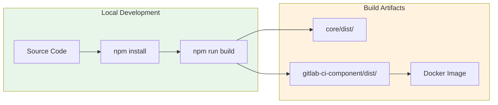
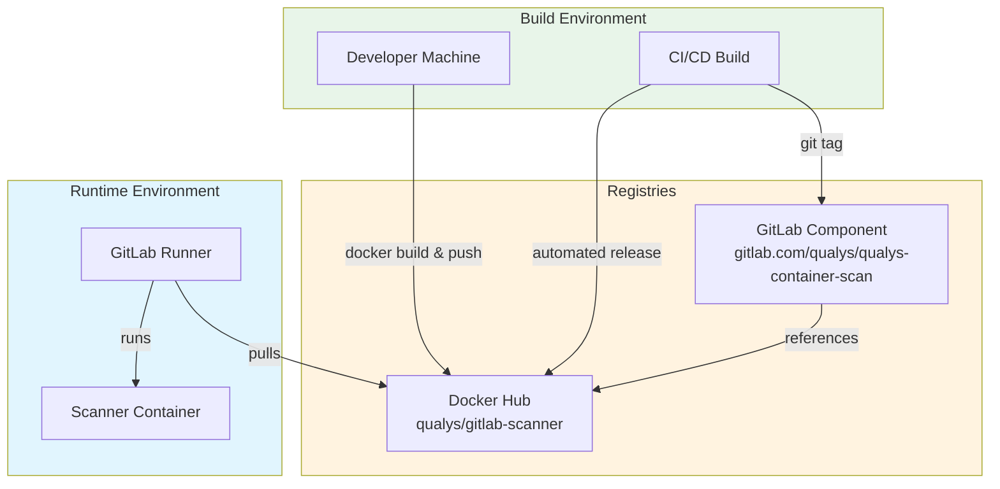
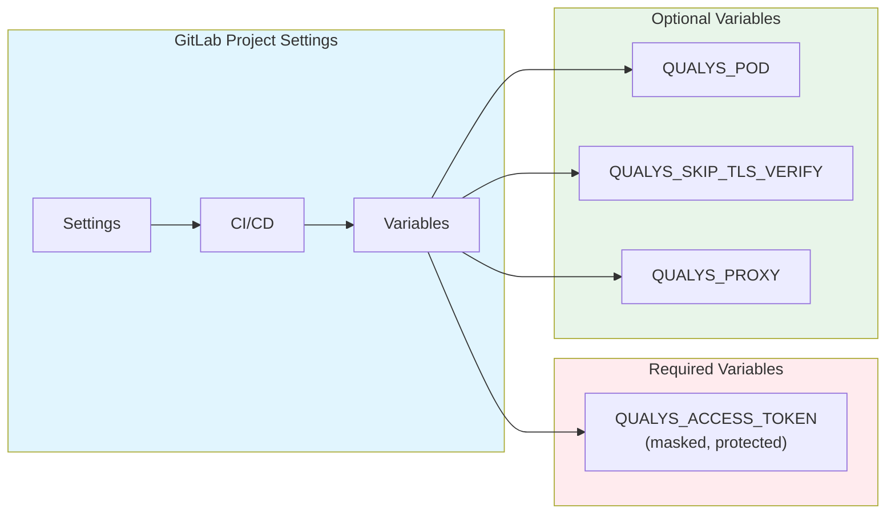

# Deployment Guide

## Prerequisites

- Node.js 20+
- Docker
- GitLab account with CI/CD access
- Qualys subscription with Container Security
- Docker Hub account (for publishing)

## Build Process



### Install Dependencies

```bash
cd qualys-gitlab
npm install
```

### Build Packages

```bash
npm run build
```

This builds both packages:
- `@qualys/gitlab-core` - Shared library
- `@qualys/gitlab-ci-component` - Scanner CLI

### Build Docker Image

```bash
docker build -t qualys/gitlab-scanner:latest \
  -f packages/gitlab-ci-component/Dockerfile .
```

## Publishing

### Docker Hub

```bash
docker login

docker tag qualys/gitlab-scanner:latest qualys/gitlab-scanner:1.0.0

docker push qualys/gitlab-scanner:latest
docker push qualys/gitlab-scanner:1.0.0
```

### GitLab Component Registry

To publish as an official GitLab CI Component:

1. Create a new GitLab project for the component
2. Add the `template.yml` to the root
3. Tag a release

```bash
git tag 1.0.0
git push origin 1.0.0
```

## Deployment Architecture



## User Integration

### Method 1: GitLab CI Component (Recommended)

Users include the component in their `.gitlab-ci.yml`:

```yaml
include:
  - component: gitlab.com/qualys/qualys-container-scan@1.0.0
    inputs:
      pod: "US3"
      image: "$CI_REGISTRY_IMAGE:$CI_COMMIT_SHA"
```

### Method 2: Direct Docker Image

Users can reference the Docker image directly:

```yaml
qualys-scan:
  stage: test
  image: qualys/gitlab-scanner:latest
  variables:
    QUALYS_POD: "US3"
    IMAGE_NAME: "$CI_REGISTRY_IMAGE:$CI_COMMIT_SHA"
  script:
    - node /app/dist/index.js
  artifacts:
    reports:
      container_scanning: gl-container-scanning-report.json
```

## CI/CD Variables Setup



### Setting Variables via UI

1. Navigate to **Settings > CI/CD > Variables**
2. Add `QUALYS_ACCESS_TOKEN`:
   - Type: Variable
   - Flags: Masked, Protected
   - Value: Your Qualys API token

### Setting Variables via API

```bash
curl --request POST \
  --header "PRIVATE-TOKEN: <gitlab-token>" \
  --form "key=QUALYS_ACCESS_TOKEN" \
  --form "value=<qualys-token>" \
  --form "masked=true" \
  --form "protected=true" \
  "https://gitlab.com/api/v4/projects/<project-id>/variables"
```

## Release Pipeline

Example `.gitlab-ci.yml` for the component repository:

```yaml
stages:
  - build
  - test
  - publish

variables:
  DOCKER_IMAGE: qualys/gitlab-scanner

build:
  stage: build
  image: docker:24
  services:
    - docker:24-dind
  script:
    - docker build -t $DOCKER_IMAGE:$CI_COMMIT_SHA -f packages/gitlab-ci-component/Dockerfile .
    - docker save $DOCKER_IMAGE:$CI_COMMIT_SHA > image.tar
  artifacts:
    paths:
      - image.tar

test:
  stage: test
  image: node:20
  script:
    - npm ci
    - npm run build
    - npm test

publish:
  stage: publish
  image: docker:24
  services:
    - docker:24-dind
  rules:
    - if: $CI_COMMIT_TAG
  script:
    - docker load < image.tar
    - docker login -u $DOCKER_USER -p $DOCKER_PASSWORD
    - docker tag $DOCKER_IMAGE:$CI_COMMIT_SHA $DOCKER_IMAGE:$CI_COMMIT_TAG
    - docker tag $DOCKER_IMAGE:$CI_COMMIT_SHA $DOCKER_IMAGE:latest
    - docker push $DOCKER_IMAGE:$CI_COMMIT_TAG
    - docker push $DOCKER_IMAGE:latest
```

## Version Matrix

| Component Version | QScanner Version | Node.js | GitLab Compatibility |
|-------------------|------------------|---------|----------------------|
| 1.0.x             | 4.8+             | 20.x    | 15.0+                |

## Troubleshooting

| Issue | Resolution |
|-------|------------|
| Function not triggering | Verify pipeline includes the component correctly |
| Authentication failed | Check QUALYS_ACCESS_TOKEN is set and valid |
| Platform not supported | Ensure linux-amd64 runner, use Docker executor |
| Scan timeout | Increase SCAN_TIMEOUT variable |
| No report generated | Check scan logs, verify image exists |

### Debug Mode

Enable debug logging:

```yaml
qualys-container-scan:
  variables:
    QUALYS_LOG_LEVEL: "debug"
```

### Manual Testing

Test the scanner locally:

```bash
docker run --rm \
  -e QUALYS_ACCESS_TOKEN="your-token" \
  -e QUALYS_POD="US3" \
  -e IMAGE_NAME="alpine:latest" \
  -v /var/run/docker.sock:/var/run/docker.sock \
  qualys/gitlab-scanner:latest
```
