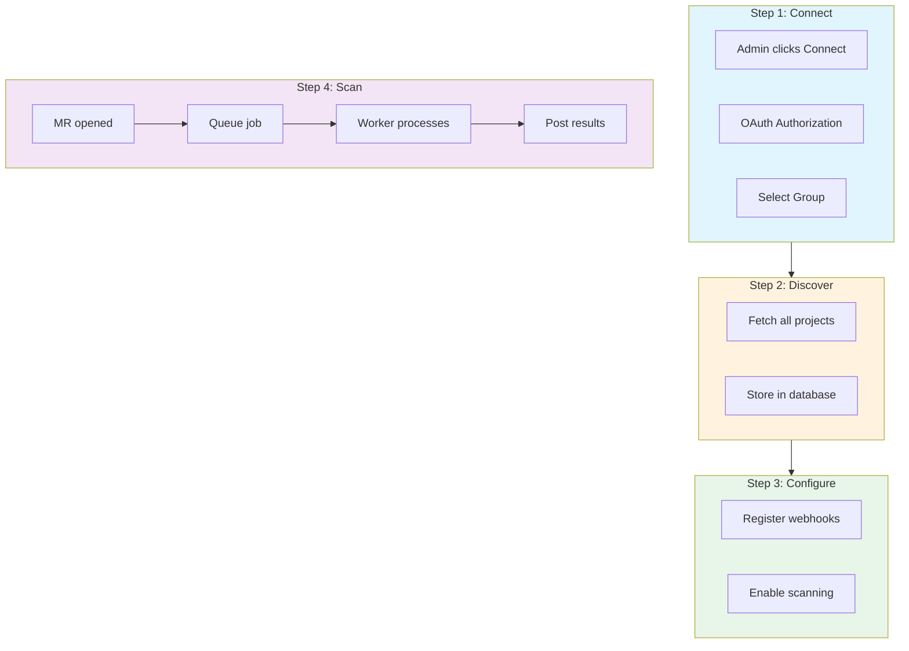
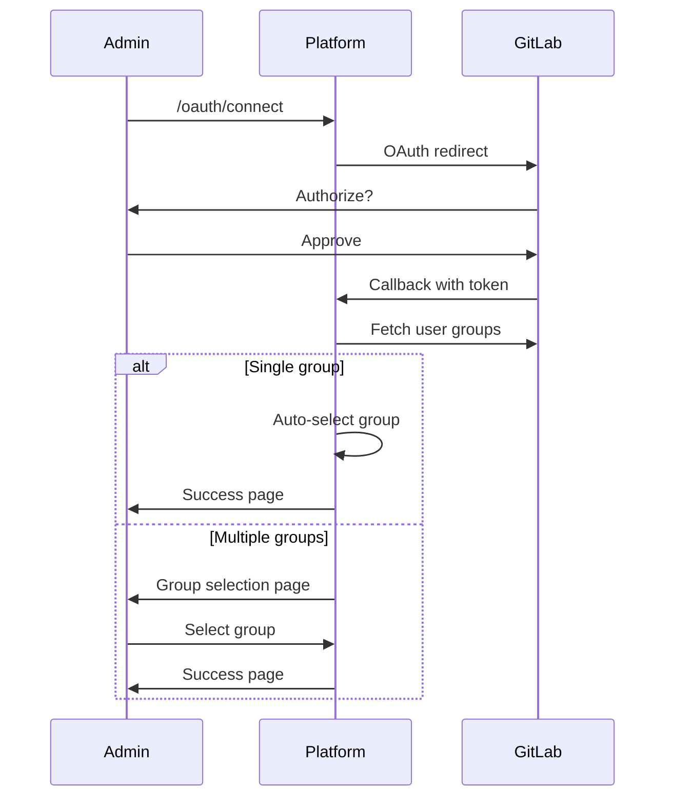
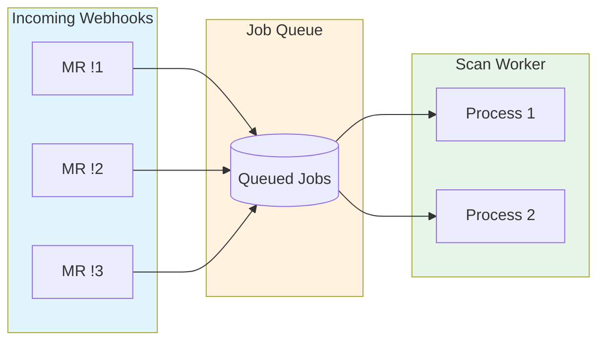
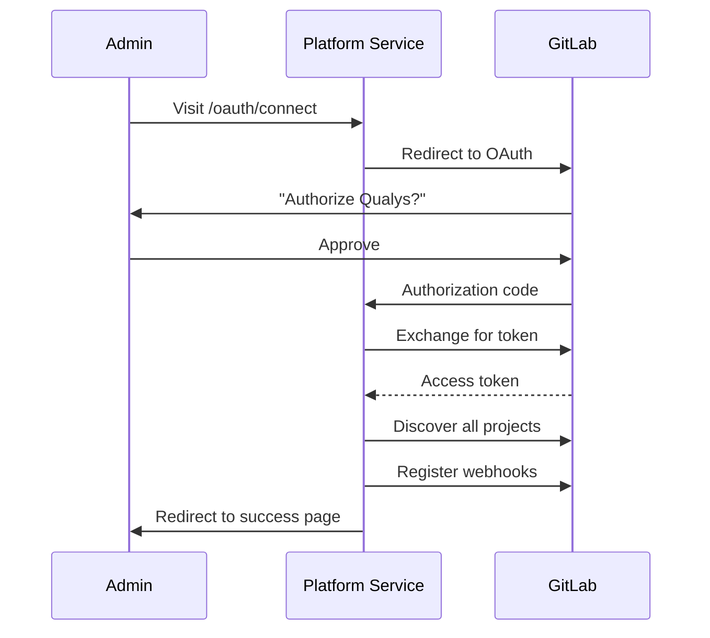
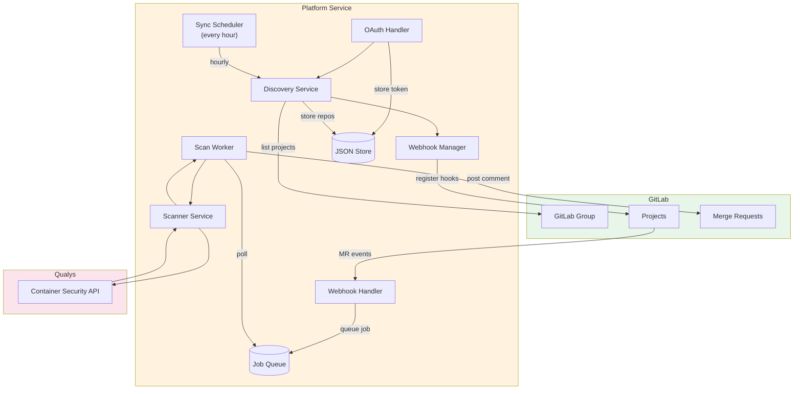

# Platform Service (Zero-Config)

The Platform Service provides enterprise-wide container scanning with a single OAuth authorization. Connect once, and all repositories are automatically discovered and configured for merge request scanning.

## How It Works



## Key Features

### Multi-Group Selection

When authorizing the OAuth application, if your account has access to multiple GitLab groups, you will see a group selection page. Choose which group to connect for container scanning.



### Queue-Based Scanning

Scans are processed asynchronously through a job queue. This prevents webhook timeouts and allows processing multiple MRs concurrently.



| Benefit | Description |
|---------|-------------|
| No timeouts | Webhooks return immediately after queueing |
| Concurrency | Up to 2 scans run in parallel (configurable) |
| Reliability | Failed jobs are logged with error details |
| Visibility | Queue status available via API |

## Customer Setup

Total time: 5 minutes

### Prerequisites

- Docker or Kubernetes for running the service
- A publicly accessible URL for webhook callbacks
- GitLab admin access (for creating OAuth application)
- Qualys access token

### Step 1: Create GitLab OAuth Application

Navigate to GitLab Admin Area > Applications:

| Setting | Value |
|---------|-------|
| Name | Qualys Container Security |
| Redirect URI | `https://your-service.example.com/oauth/callback` |
| Trusted | Yes (recommended) |
| Confidential | Yes |
| Scopes | `api`, `read_user`, `read_repository` |

Save the Application ID and Secret.

### Step 2: Deploy the Platform Service

**Docker:**

```bash
docker run -d \
  --name qualys-platform \
  -p 3000:3000 \
  -v qualys-data:/app/data \
  -e QUALYS_ACCESS_TOKEN="your-qualys-token" \
  -e QUALYS_POD="US3" \
  -e GITLAB_APP_ID="your-oauth-app-id" \
  -e GITLAB_APP_SECRET="your-oauth-app-secret" \
  -e BASE_URL="https://your-service.example.com" \
  qualys/gitlab-platform-service:latest
```

**Docker Compose:**

```yaml
version: '3.8'
services:
  platform:
    image: qualys/gitlab-platform-service:latest
    ports:
      - "3000:3000"
    volumes:
      - platform-data:/app/data
    environment:
      - QUALYS_ACCESS_TOKEN=${QUALYS_ACCESS_TOKEN}
      - QUALYS_POD=${QUALYS_POD}
      - GITLAB_APP_ID=${GITLAB_APP_ID}
      - GITLAB_APP_SECRET=${GITLAB_APP_SECRET}
      - BASE_URL=${BASE_URL}
    restart: unless-stopped

volumes:
  platform-data:
```

### Step 3: Connect Your GitLab Organization

1. Open `https://your-service.example.com/oauth/connect`
2. GitLab prompts: "Authorize Qualys Container Security?"
3. Click **Authorize**
4. Done. All repositories are now configured.



## What Happens Automatically

| Event | Response |
|-------|----------|
| OAuth authorized | All repos discovered, webhooks registered |
| New repo created | Discovered within 1 hour, webhook registered |
| MR opened | Image scanned, results posted as comment |
| MR updated | Re-scanned with new commit |
| Token expiring | Automatic refresh |

## Configuration

### Environment Variables

| Variable | Required | Default | Description |
|----------|----------|---------|-------------|
| `QUALYS_ACCESS_TOKEN` | Yes | - | Qualys API access token |
| `QUALYS_POD` | Yes | - | Qualys platform POD |
| `GITLAB_APP_ID` | Yes | - | GitLab OAuth Application ID |
| `GITLAB_APP_SECRET` | Yes | - | GitLab OAuth Application Secret |
| `BASE_URL` | Yes | - | Public URL of this service |
| `PORT` | No | 3000 | Service port |
| `DATABASE_PATH` | No | /app/data/qualys-gitlab.json | Data storage path |
| `SYNC_INTERVAL_MINUTES` | No | 60 | Repo discovery interval |
| `SCAN_TYPES` | No | pkg | Comma-separated scan types |
| `FAIL_ON_SEVERITY` | No | 4 | Fail threshold |

### Scan Configuration

Control what gets scanned:

| Variable | Options | Description |
|----------|---------|-------------|
| `SCAN_TYPES` | `pkg`, `secret`, `malware` | What to scan for |
| `FAIL_ON_SEVERITY` | 5=critical, 4=high, 3=medium | When to fail the check |
| `SCAN_TIMEOUT` | Seconds | Maximum scan duration |

## API Endpoints

### Public Endpoints

| Endpoint | Method | Description |
|----------|--------|-------------|
| `/` | GET | Service info |
| `/health` | GET | Health check |
| `/oauth/connect` | GET | Start OAuth flow |
| `/oauth/callback` | GET | OAuth callback |
| `/webhook` | POST | GitLab webhook receiver |

### Admin API

| Endpoint | Method | Description |
|----------|--------|-------------|
| `/api/organizations` | GET | List connected organizations |
| `/api/organizations/:id` | GET | Get organization details |
| `/api/organizations/:id/repositories` | GET | List discovered repositories |
| `/api/organizations/:id/sync` | POST | Trigger manual sync |
| `/api/organizations/:id` | DELETE | Disconnect organization |
| `/api/queue/status` | GET | Get scan queue status |

### Example: List Organizations

```bash
curl https://your-service.example.com/api/organizations
```

```json
[
  {
    "id": 1,
    "groupPath": "my-org",
    "gitlabUrl": "https://gitlab.com",
    "status": "active",
    "lastSyncAt": "2024-01-15T10:30:00.000Z",
    "createdAt": "2024-01-01T00:00:00.000Z"
  }
]
```

### Example: Trigger Manual Sync

```bash
curl -X POST https://your-service.example.com/api/organizations/1/sync
```

```json
{
  "status": "ok",
  "repositoriesDiscovered": 50,
  "webhooksRegistered": 48,
  "webhooksFailed": 2
}
```

### Example: Queue Status

```bash
curl https://your-service.example.com/api/queue/status
```

```json
{
  "running": true,
  "processing": 1,
  "queued": 3
}
```

## Architecture



## Data Storage

The service uses JSON file storage for simplicity. Data is stored at `/app/data/qualys-gitlab.json`:

```json
{
  "organizations": [
    {
      "id": 1,
      "gitlabGroupId": 12345,
      "gitlabGroupPath": "my-org",
      "gitlabUrl": "https://gitlab.com",
      "accessToken": "...",
      "refreshToken": "...",
      "tokenExpiresAt": "2024-02-01T00:00:00.000Z",
      "status": "active",
      "lastSyncAt": "2024-01-15T10:30:00.000Z"
    }
  ],
  "repositories": [
    {
      "id": 1,
      "organizationId": 1,
      "gitlabProjectId": 67890,
      "name": "my-project",
      "pathWithNamespace": "my-org/my-project",
      "webUrl": "https://gitlab.com/my-org/my-project",
      "webhookId": 123456,
      "webhookStatus": "active",
      "scanEnabled": true
    }
  ]
}
```

For production deployments with high availability requirements, consider migrating to PostgreSQL.

## Troubleshooting

| Issue | Resolution |
|-------|------------|
| OAuth callback error | Verify redirect URI matches exactly |
| No repos discovered | Check OAuth scopes include `api` and `read_repository` |
| Webhook registration failed | Verify user has maintainer access to projects |
| Scans not triggering | Check webhook is set to MR events |
| Token refresh failed | Re-authorize the organization |

### View Logs

```bash
# Docker
docker logs qualys-platform

# Docker Compose
docker-compose logs -f platform
```

## Comparison with Other Options

| Feature | CI Component | Webhook Service | Platform Service |
|---------|--------------|-----------------|------------------|
| Setup per project | Yes | One webhook | None |
| New repo coverage | Manual | Manual | Automatic |
| Token management | CI variables | Service config | OAuth (auto-refresh) |
| Admin dashboard | No | No | Yes |
| Best for | CI/CD integration | Central scanning | Enterprise-wide |
