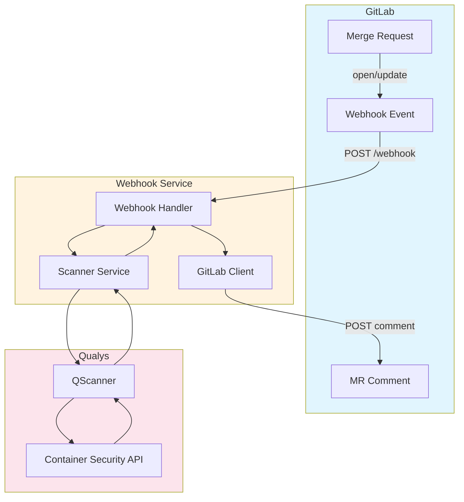
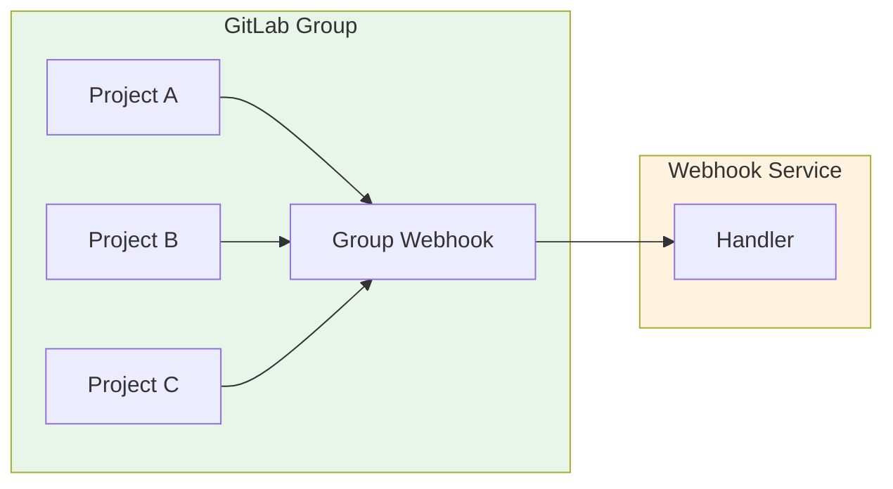
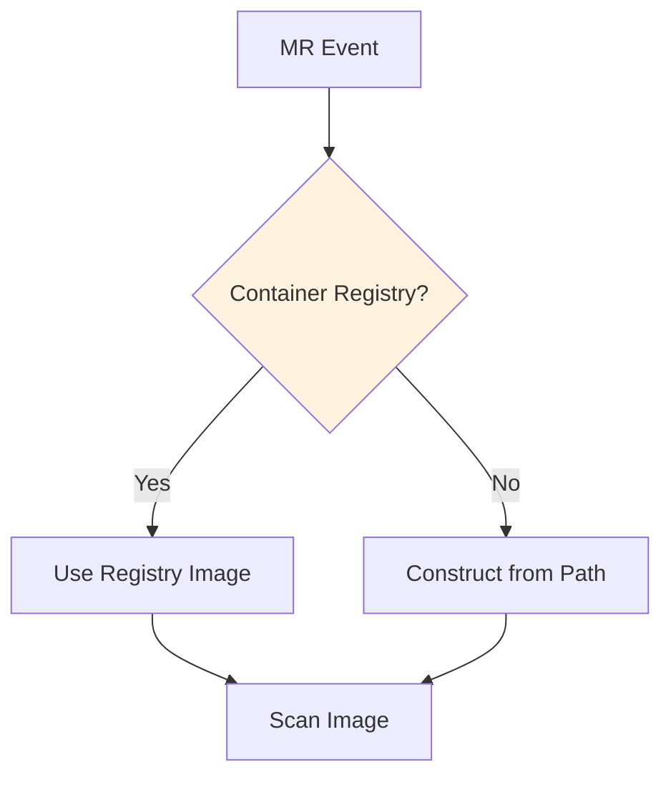
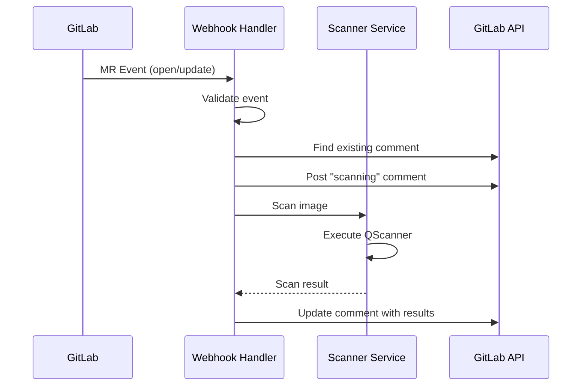

# Webhook Service

The webhook service provides automated MR scanning triggered by GitLab webhooks. When a merge request is opened or updated, the service scans the associated container image and posts results as an MR comment.

## Architecture



## Configuration

### Environment Variables

| Variable | Required | Default | Description |
|----------|----------|---------|-------------|
| `QUALYS_ACCESS_TOKEN` | Yes | - | Qualys API access token |
| `QUALYS_POD` | Yes | - | Qualys platform POD |
| `GITLAB_URL` | Yes | - | GitLab instance URL |
| `GITLAB_TOKEN` | Yes | - | GitLab API token with api scope |
| `WEBHOOK_SECRET` | No | - | Secret token for webhook verification |
| `PORT` | No | 3000 | Service port |
| `HOST` | No | 0.0.0.0 | Service host |
| `SCAN_TYPES` | No | pkg | Comma-separated scan types |
| `SCAN_TIMEOUT` | No | 300 | Scan timeout in seconds |
| `FAIL_ON_SEVERITY` | No | 4 | Fail threshold (5=critical, 4=high) |

### GitLab Token Permissions

The GitLab token requires:
- `api` scope for posting comments and reading project data
- Access to projects that will use the webhook

## Deployment

### Docker Compose

```bash
cd packages/webhook-service

# Set environment variables
export QUALYS_ACCESS_TOKEN="your-token"
export QUALYS_POD="US3"
export GITLAB_URL="https://gitlab.com"
export GITLAB_TOKEN="your-gitlab-token"

docker-compose up -d
```

### Kubernetes

```bash
# Create secrets
kubectl create secret generic qualys-gitlab-secrets \
  --from-literal=qualys-access-token="your-token" \
  --from-literal=gitlab-token="your-gitlab-token"

# Update configmap
kubectl edit configmap qualys-gitlab-config

# Deploy
kubectl apply -f k8s/deployment.yaml
```

### Docker

```bash
# Build from repo root
docker build -t qualys/gitlab-webhook-service:latest \
  -f packages/webhook-service/Dockerfile .

# Run
docker run -d \
  -p 3000:3000 \
  -e QUALYS_ACCESS_TOKEN="your-token" \
  -e QUALYS_POD="US3" \
  -e GITLAB_URL="https://gitlab.com" \
  -e GITLAB_TOKEN="your-gitlab-token" \
  -v /var/run/docker.sock:/var/run/docker.sock:ro \
  qualys/gitlab-webhook-service:latest
```

## GitLab Webhook Setup

### Project Level

1. Navigate to **Settings > Webhooks**
2. Add webhook:
   - URL: `https://your-service-url/webhook`
   - Secret token: (optional, must match WEBHOOK_SECRET)
   - Trigger: Merge request events
   - SSL verification: Enable

### Group Level

For organization-wide coverage, configure the webhook at the group level:

1. Navigate to **Group Settings > Webhooks**
2. Same configuration as project level



## API Endpoints

| Endpoint | Method | Description |
|----------|--------|-------------|
| `/` | GET | Service info |
| `/health` | GET | Health check |
| `/webhook` | POST | GitLab webhook receiver |

### Health Check Response

```json
{
  "status": "ok",
  "timestamp": "2024-01-15T10:30:00.000Z"
}
```

## MR Comment Format

The service posts scan results as MR comments:

```markdown
## Qualys Security Scan Results

**Status:** PASSED

**Branch:** `feature/add-auth` to `main`
**Image:** `registry.gitlab.com/org/project:abc12345`

### Vulnerability Summary

| Severity | Count |
|----------|-------|
| Critical | 0 |
| High | 2 |
| Medium | 5 |
| Low | 12 |
| Informational | 3 |
| **Total** | **22** |

---
*Powered by Qualys Container Security*
```

## Image Discovery

The service discovers container images using these strategies:

1. **GitLab Container Registry**: Queries the project's container registry for repositories
2. **Convention-based**: Constructs image name from project path and commit SHA



## Event Processing



## Troubleshooting

| Issue | Resolution |
|-------|------------|
| Webhook not received | Verify URL is accessible, check GitLab webhook logs |
| 401 Unauthorized | Check WEBHOOK_SECRET matches GitLab config |
| No comment posted | Verify GITLAB_TOKEN has api scope |
| Image not found | Check container registry access, verify image exists |
| Scan timeout | Increase SCAN_TIMEOUT, check network connectivity |

### Logs

The service uses Fastify's built-in logger. View logs with:

```bash
# Docker
docker logs <container-id>

# Kubernetes
kubectl logs deployment/qualys-gitlab-webhook
```
